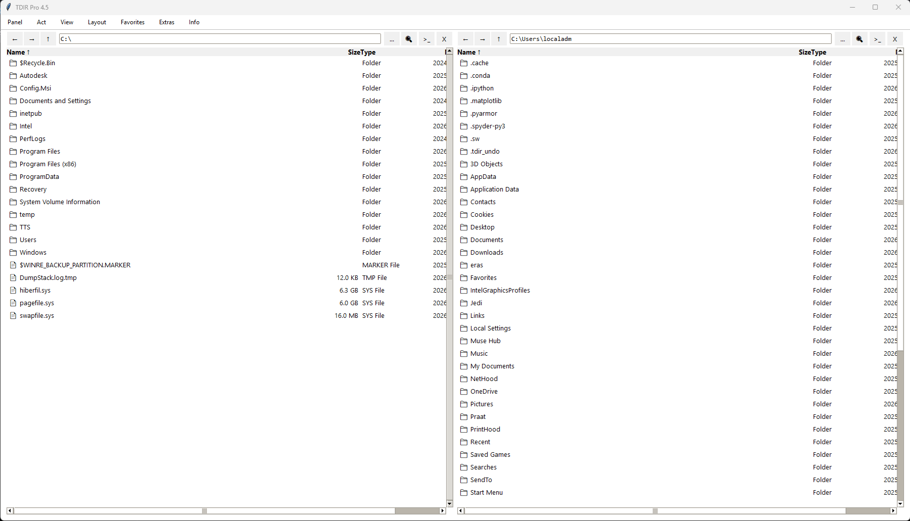

# 🚀 TDIR Pro 4.6 - Custom Multi-Panel File Manager

**TDIR Pro** is a lightweight, fast and flexible file manager designed for users who need efficient file operations with a **custom multi-panel interface**.  
*TDIR Pro là trình quản lý tập tin nhẹ, nhanh và linh hoạt, được thiết kế cho người dùng cần thao tác file hiệu quả với giao diện đa panel tùy chỉnh.*

It runs directly on **Windows & Linux** — *no Python installation required.*
Hỗ trợ chạy trực tiếp trên **Windows & Linux** — *không cần cài đặt Python.*

📸 Preview  

> Flexible multi-panel interface with fast navigation  
> Giao diện nhiều panel linh hoạt, thao tác nhanh

### ✨ Key Features / *Tính năng nổi bật*

- Custom multi-panel flexible layout (Row / Column / Grid)  
  *Bố cục đa panel tùy chỉnh linh hoạt (Dọc / Ngang / Lưới)*
- Full Undo system (Ctrl+Z)  
  *Hệ thống Undo hoàn chỉnh (Ctrl+Z)*
- Inline rename, rubberband multi-select & smooth drag & drop  
  *Đổi tên nhanh, chọn nhiều bằng khung kéo và kéo thả mượt mà*
- Create Zip & Extract (.zip, .rar, .7z)  
  *Tạo và giải nén file nhanh*
- Quick search by typing & advanced wildcard search  
  *Tìm kiếm nhanh bằng cách gõ và tìm kiếm nâng cao*
- Beautiful Light/Dark theme + font size adjustment  
  *Giao diện Light/Dark đẹp + thay đổi cỡ chữ*
- No Python required (pre-built executable)  
  *Không cần cài Python (đã build sẵn file chạy trực tiếp)*

### 📥 Download / *Tải về*

**Latest version 4.6** (March 2026)

- **Windows**: [TDIR-Pro-4.6-Windows.exe]  
- **Linux (Ubuntu)**: [TDIR-Pro-4.6-Linux]

**All releases** → [Releases](https://github.com/tangkhanhtoan/TDIR-Pro/releases)

### 📖 How to use / *Hướng dẫn sử dụng*

Detailed instructions are available in **[User Guide](docs/user_guide.md)**  
*Hướng dẫn sử dụng chi tiết có trong **[User Guide](docs/user_guide.md)***

### 🔑 License & Purchase / *License & Mua bản Full*

- **Trial**: 14 days free (automatically activated on first run)  
  *Trial: 14 ngày sử dụng miễn phí (tự động kích hoạt khi chạy lần đầu)*
- **Full Version**: Lifetime, no limit, no ads – **499.000 VNĐ** (one-time payment)  
  *Bản Full: Vĩnh viễn, không giới hạn, không quảng cáo – **499.000 VNĐ** (mua một lần)*

**How to buy and activate:**  
*Cách mua và kích hoạt:*
1. Open the program → **Extras → Get HWID** (HWID is automatically copied to clipboard)  
   *Mở chương trình → Extras → Get HWID (HWID tự động copy vào clipboard)*
2. Send the HWID to me via Zalo **0901 005 336** or email **tangkhantoan@gmail.com**  
   *Gửi HWID cho tôi qua Zalo **0901 005 336** hoặc email **tangkhantoan@gmail.com***
3. I will send you back a **16-character License Key**  
   *Tôi sẽ gửi lại **License Key 16 ký tự***
4. Go to **Extras → Activate License** and paste the key  
   *Vào **Extras → Activate License** → dán key*

### 📞 Contact & Support / *Liên hệ & Hỗ trợ*

- Author: Tăng Khánh Toàn  
  *Tác giả: Tăng Khánh Toàn*
- Email: tangkhantoan@gmail.com  
  *Email: tangkhantoan@gmail.com*
- Zalo: 0901 005 336  
  *Zalo: 0901 005 336*

## ⚠️ Terms of Use / *Điều khoản sử dụng*

- This software is the intellectual property of the author.  
  *Phần mềm thuộc quyền sở hữu trí tuệ của tác giả.*
- Reverse engineering or redistribution is strictly prohibited.  
  *Không được phép reverse engineering hoặc phân phối lại.*
- Commercial use requires a valid license.  
  *Sử dụng thương mại yêu cầu license hợp lệ.*

---

**Thank you for using TDIR Pro!** ❤️  
*Cảm ơn bạn đã sử dụng TDIR Pro! ❤️*
